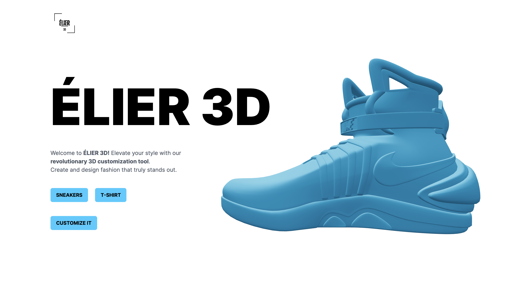

# Élier3D


 ÉLIER 3d is a project that combines the prowess of several libraries and frameworks to showcase advanced 3D graphics and animations.



## 📸  Demo


## 🌟 Features

- **ThreeJS**: Harnessing the capabilities of ThreeJS for efficient rendering and animation of 3D models.
- **React Three Fiber**: A seamless blend of 3D graphics with React components.
- **TailwindCSS**: Rapid and utility-first UI development.
- **Framer Motion**: Enriched user experience with fluid animations.
- **DALLE AI**: Generating and incorporating images.
- **Stripe Integration**: Implementing secure payment solutions for a seamless user checkout experience.
- **Responsive Design**: Ensuring optimal experience across all device sizes.


## 🔍 What You Can Do

- 🌐 Load, craft, and customize 3D models and geometries.
- 💡 Immerse in the 3D world with cameras, lights, and object positioning.
- 🔄 Use Higher Order Components (HOCs) for scalable and reusable code.
- 🎨 Add custom color and file support.
- 🖼️ Download the resulting t-shirt model image.

## 🚀 Getting Started

To set up and run the project locally, follow these steps:

1. **Client Setup**:
   ```
   cd client
   npm run dev
   ```
2. **Server Setup**:
   ```
   cd server
   npm run start
   ``````

## 🙌 Credits

- **Project Inspiration**: [JavaScript Mastery](https://www.jsmastery.pro/)
- **3D Model**: [Alexei Ostapenko](https://sketchfab.com/3d-models/futuristic-high-top-sneakers-39ee9f7b201a4c1f9138fa0fd6d163c0)